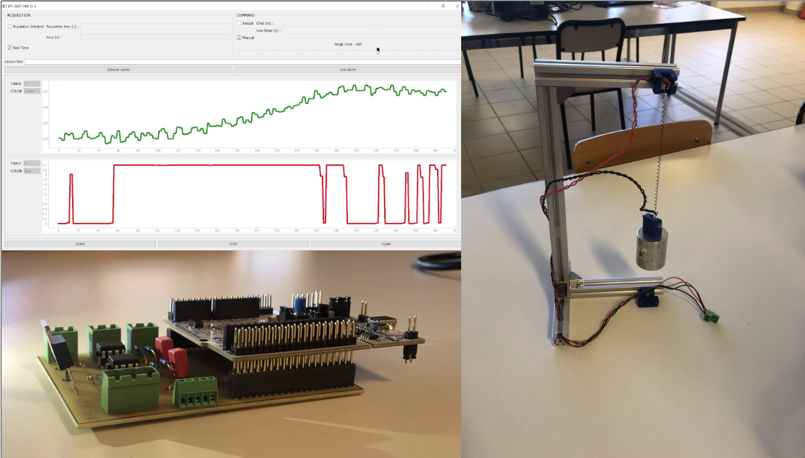
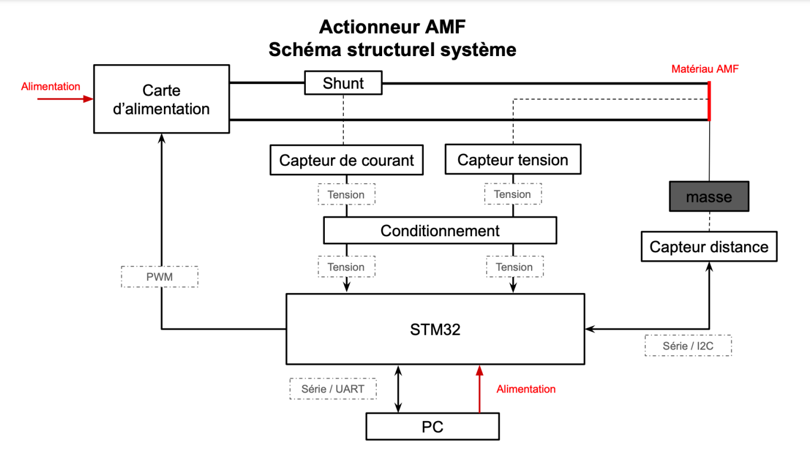

# ASSERVISSEMENT EN POSITION D’UNE MASSE SUSPENDUE À UN RESSORT À MÉMOIRE DE FORME

## Introduction
Les matériaux à mémoire de forme ont la particularité de
se contracter ou de se détendre en fonction de la température. Ainsi nous souhaitons asservir la position d’une masse suspendue à une potence à l’aide d’un actionneur AMF en contrôlant la puissance de chauffe. Dans le cadre de ce projet nous réalisons une carte électronique permettant la mesure du courant et de la tension au borne du matériau. Nous mettons en œuvre un microcontrôleur utilisé pour commander un transistor afin de moduler la puissance de chauffe. Ce microcontrôleur est aussi dédié à la mesure de la position de la masse (capteur laser) et à la communication série avec une interface Homme Machine.

## Les principaux objectifs sont les suivant : 
- Routage d’une carte électronique dédié au projet
- Mesure Tension/Courant 
- Commuter la puissance de chauffe
- Asservissement de la position
- Interface Humain Machine permettant le contrôle de la position

## Matériel : 
- Capteur de distance ToF VL53L0X .
- Une potence en Profilé 2020, une masse, un ressort AMF. 
- Résistance de shunt : Résistance fixe à couche métallique 50mΩ 1%, 1W Ref : MSR-1 R05 F 
- Carte Nucleo STM F411RE
- Transistors de puissance MOSFET Canal N IRLZ34NPBF
- Amplificateurs d’instrumentation AD620 

## Schéma Structurel du système : 

## Réponse temporelle :

